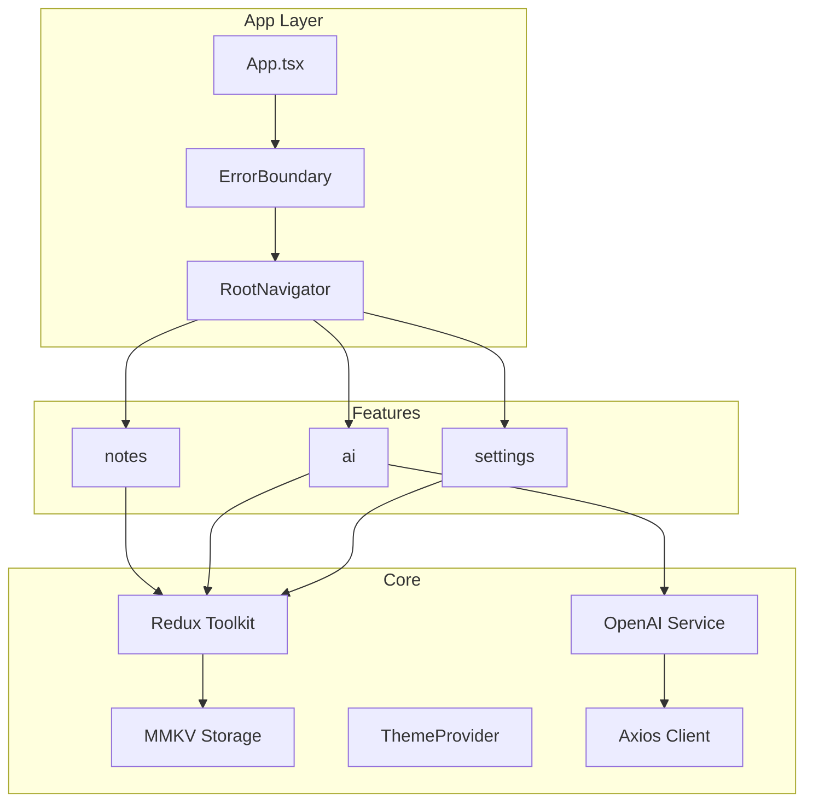

# NeuroNote AI

An offline-first AI note-taking app built with **React Native New Architecture**. Save notes locally, then use AI to summarize, organize, and extract action items — or chat with your notes as context.

## Elevator Pitch

NeuroNote AI lets you capture thoughts offline and instantly ask AI to summarize meetings, pull out action items, or answer questions across all your notes.

## Features

- **Notes CRUD** — Create, edit, delete, and search notes stored locally with MMKV
- **AI Summarize** — Extract summaries and action items from any note via OpenAI
- **Chat With Notes** — Ask questions like "What tasks are pending?" using all notes as context
- **Dark Mode** — System, light, or dark appearance override
- **Offline-first** — Notes work without network; AI features require connectivity + API key

## Tech Stack

| Layer | Technology |
|-------|------------|
| Framework | React Native 0.86+ (New Architecture) |
| Language | TypeScript |
| State | Redux Toolkit |
| Storage | MMKV |
| AI | OpenAI API (gpt-4o-mini) |
| Forms | React Hook Form + Zod |
| Navigation | React Navigation (bottom tabs + native stack) |
| Styling | StyleSheet + design tokens |
| HTTP | Axios with typed error handling |

## Architecture



## Project Structure

```
src/
├── app/              App entry + bootstrap
├── navigation/       Tab + stack navigators
├── components/     ErrorBoundary + shared UI
├── theme/            Colors, spacing, typography
├── store/            Redux slices
├── services/
│   ├── api/          Axios client + typed errors
│   └── ai/           OpenAI service + prompts
├── storage/          MMKV persistence
├── hooks/            useNotes, useAI, useSettings
├── types/            Shared TypeScript types
├── utils/            Date formatting, ID generation
└── features/
    ├── notes/        Notes list + editor
    ├── ai/           Summarize + chat screens
    └── settings/     API key + appearance
```

## Getting Started

### Prerequisites

- Node.js >= 22.11
- Xcode (iOS) / Android Studio (Android)
- OpenAI API key

### Install

```bash
npm install
cd ios && pod install && cd ..
```

### Run

```bash
# Start Metro
npm start

# iOS
npm run ios

# Android
npm run android
```

### Configure OpenAI

1. Open the app → **Settings** tab
2. Paste your OpenAI API key (`sk-…`)
3. Tap **Save API Key**

Your key is stored **locally on device only** via MMKV — never committed to git.

## Usage

1. **Create notes** on the Notes tab (+ FAB button)
2. **Search** notes with the search bar
3. **Summarize** — AI tab → select a note → Summarize
4. **Chat** — AI tab → "Chat with all notes" → ask questions

## Testing

```bash
npm test
npm run lint
```

## Screenshots

> Add screenshots to `docs/screenshots/` after running the app.

| Screen | Description |
|--------|-------------|
| Notes List | Card-based note list with search |
| Note Editor | Create/edit with form validation |
| AI Summarize | Summary + action items |
| Chat | Conversational Q&A over notes |
| Settings | API key + dark mode |

## License

Private — portfolio / interview project.
